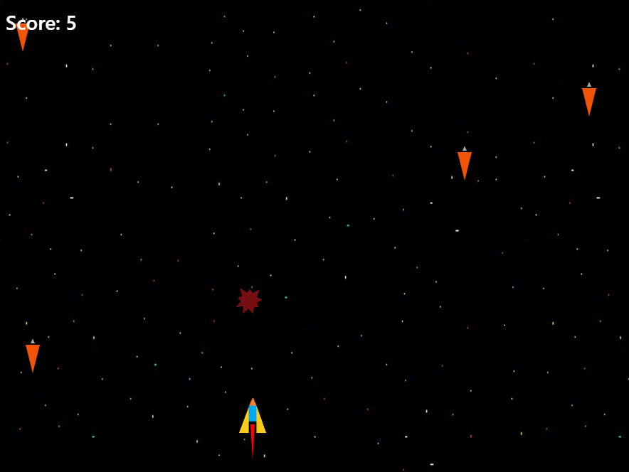
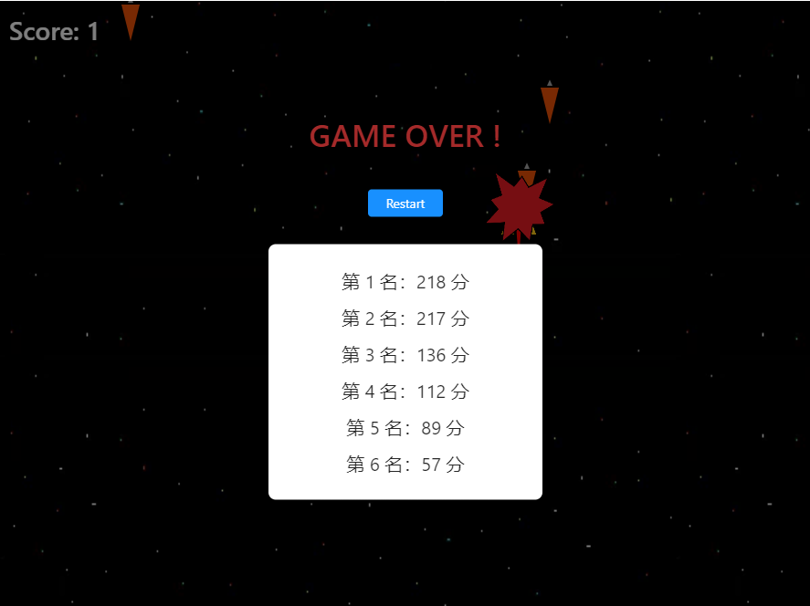

# Command

## Launching your Project

```
electron-forge start
```

## Packaging your Project

```
electron-forge package
```

## Generating a distributable for your Project

```
electron-forge make
```

## Publishing your Project

```
electron-forge publish
```

This will make your project and publish any generated artifacts. By default it will publish to GitHub, but you can change the publish target(s) with --target=YourTarget,YourTarget2, where the value is a comma-separated list of targets.

# Game Preview

## Game playing



## Game Over


